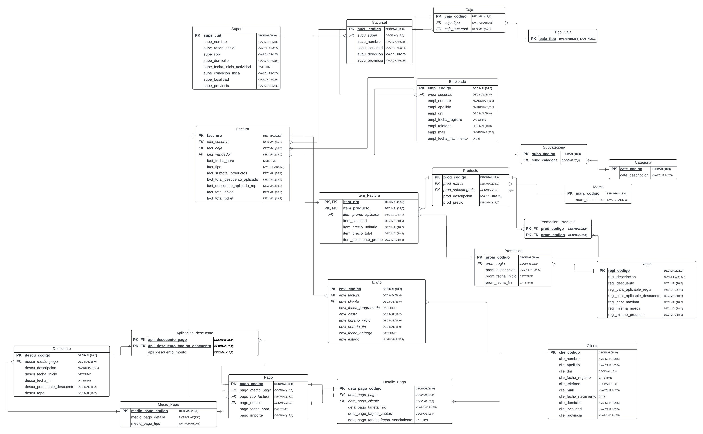

# Trabajo Practico Gestion de Datos Cuatrimestre 1 2024.

Grupo GeDeDe




Entregas

[x] Der 10/5

[]  Migracion de DDL Y DML

[] Power BI

## How to

- Modificar el archivo run.bat, cambiar la maquina y la instancia de la base de datos.
- Si se loguea con usuario y password, agregarle el usuario y password al comando
- Ejecutar el comando run.bat:

```
.\run.bat
```


## Chagelog

- Agregamos el DER Inicial para poder iterar sobre el mismo. No es el final. 
- Mejoramos el DER, lo hicimos UML
- Creamos un archivo migrations/GeDeDe_Migracion.sql el cual vamos a utilizar en la entrega 2 de migraciones de schema y data.
- Desarrollamos el store procedure que crea la base de datos y genera las tablas del DER.
- Dividimos el procedimiento en varios archivos .sql donde en uno creamos la db, en otro creamos el store procedure correspondiente para tareas ddl, en otro creamos el store procedure para dml, en otro archivo ejecutamos el store procedure ddl y en otro ejecutamos la migracion dml. \El orden de ejecucion de estos archivos se los da run.bat
- Agregue el primer query select/insert de dml donde cargamos el Super.
- Cada select/insert va a estar logicamente en un bloque BEGIN/END diferente.


## TODO

- Agregar un timer en el .bat donde podamos loguear el tiempo que tarda en ejecutar cada uno de los .sql