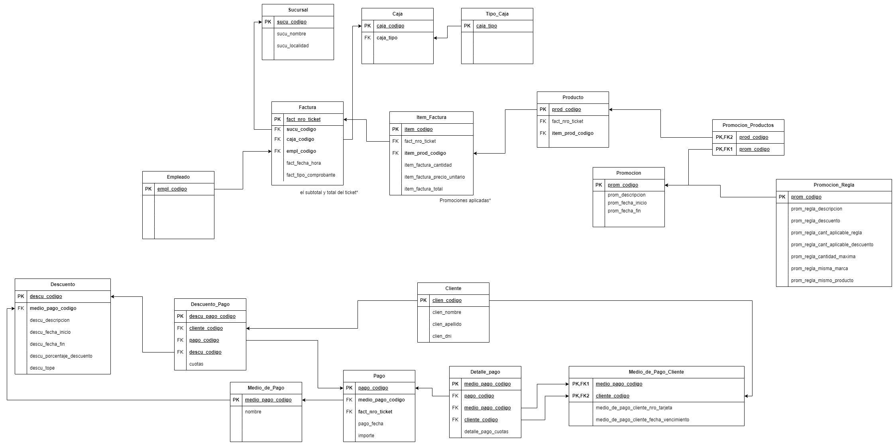

# gd1c2024

## Chagelog

- Agregamos el DER Inicial para poder iterar sobre el mismo. No es el final. 
- Creamos un archivo run.sql el cual vamos a utilizar en la entrega 2 de migraciones de schema y data.